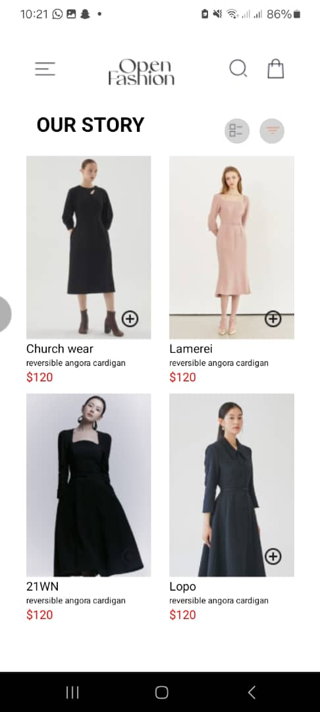
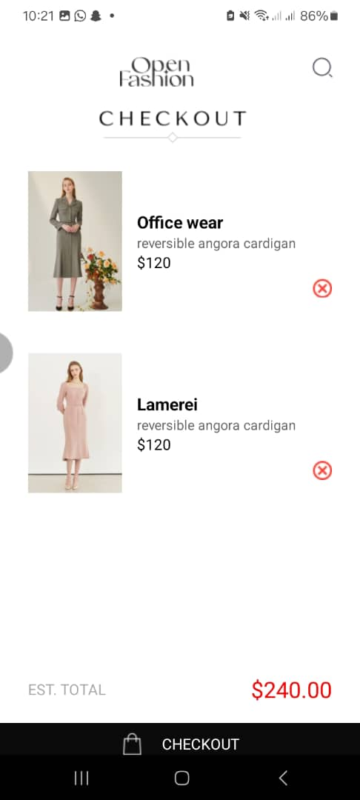

# rn-assignment6-11333179
# Description
This is a fashion app that uses basic react components such as component-based design, local storage with AsyncStorage, and state management with hooks.It has two screens, the homescreen and cartscreen.
 
 # HomeScreen 
 -Post a collection of fashion items with images, the name of items, their descriptions, and prices. 
 -A cart can be added with an ‘add to cart’ button to be able to add items into it. 
 -The addToCart function sets data such as item id, item name, price, quantity and amount to AsyncStorage. 
 
 
 # CartScreen 
 -Shows the products placed in the cart section of the GUI. 
 -Shows item details: Name, Image, Description and Price are the attributes of the products. 
 -Products can be taken out of cart and this is done by a “remove” button. 
 -The removeFromCart function removes items from the AsyncStorage. 
 -Indicates the total bill for items contained in the cart at the base of the screen. 
 -Incorporates a buy now button to enable the buyer to continue through the buying process. 

# Screenshots
Homescreen

CartScreen
